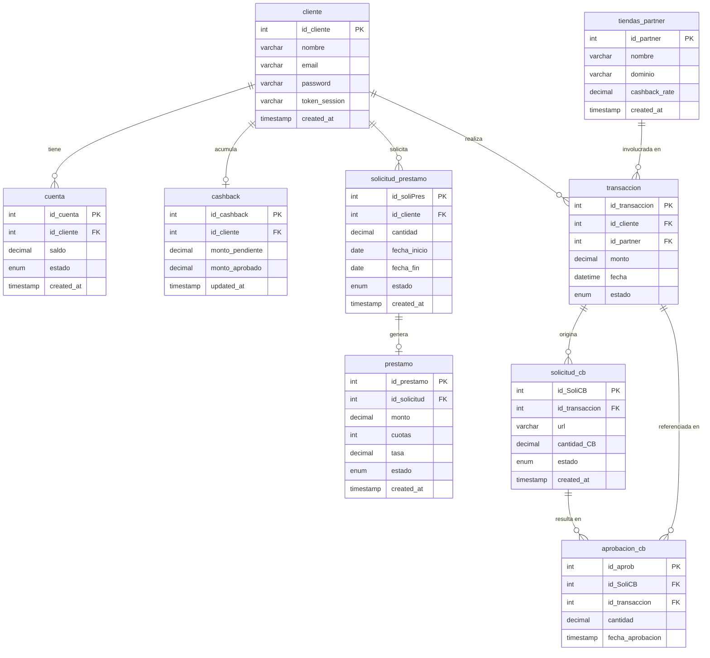

# Database Reference

SQL queries used by each endpoint, and the entity-relationship diagram for `kueski_db`.

---

## Entity-Relationship Diagram (Crow's Foot Notation)



---

## Queries by Functional Requirement

### FR-1 · Authentication — `POST /auth/login`

Validates client credentials and returns a signed JWT.

```sql
-- Fetch client by email to verify credentials
SELECT id_cliente, nombre, email, password
FROM cliente
WHERE email = ?;
```

**Tables:** `cliente`
**Expected result:** 1 row. No match or wrong password → 401.

---

### FR-2 · User Dashboard — `GET /users/me/dashboard`

Returns the available balance from the active account and the approved cashback for the authenticated client.

```sql
-- Balance from the client's active account
SELECT saldo
FROM cuenta
WHERE id_cliente = ? AND estado = 'ACTIVA';
```

```sql
-- Approved cashback available to the client
SELECT monto_aprobado
FROM cashback
WHERE id_cliente = ?;
```

Both queries run in parallel (`Promise.all`).

**Tables:** `cuenta`, `cashback`
**Expected result:** At least 1 row in `cuenta`; the `cashback` row is optional (defaults to 0 if absent).

---

### FR-3 · Active Loans — `GET /users/loans`

Lists all active loans for the client with amount, rate, installments, and due date.

```sql
SELECT
    p.id_prestamo,
    sp.cantidad,
    p.tasa,
    p.cuotas,
    p.created_at  AS fecha_aprobacion,
    sp.fecha_fin
FROM prestamo p
JOIN solicitud_prestamo sp ON p.id_solicitud = sp.id_soliPres
WHERE sp.id_cliente = ?
  AND p.estado = 'ACTIVO'
ORDER BY sp.fecha_fin ASC;
```

**Tables:** `prestamo`, `solicitud_prestamo`
**Join:** `prestamo.id_solicitud = solicitud_prestamo.id_soliPres`
**Order:** by nearest due date first.
**Expected result:** 0 or more rows; 0 rows → 404.

---

### FR-4 · Check Store Benefits — `GET /commerce/benefits?domain=`

Checks whether a domain belongs to a partner store and returns its cashback rate.

```sql
-- Verify if the domain is a partner and retrieve its cashback rate
SELECT cashback_rate
FROM tiendas_partner
WHERE dominio = ?;
```

**Tables:** `tiendas_partner`
**Expected result:** 1 row → `is_partner: true`; 0 rows → `is_partner: false`.

---

### FR-5 · Simulate Transaction — `POST /commerce/transactions/simulate`

Calculates installment payment plans for a given amount, taking into account the client's balance, available cashback, and the cashback rate of the partner store.

```sql
-- Balance from the client's active account
SELECT saldo
FROM cuenta
WHERE id_cliente = ? AND estado = 'ACTIVA';
```

```sql
-- Approved cashback available to the client
SELECT monto_aprobado
FROM cashback
WHERE id_cliente = ?;
```

```sql
-- Cashback rate for the partner store by id
SELECT cashback_rate
FROM tiendas_partner
WHERE id_partner = ?;
```

All three queries run in parallel (`Promise.all`).

**Tables:** `cuenta`, `cashback`, `tiendas_partner`
**Business logic applied over the results:**

- `is_approved`: `monto <= saldo + cashback_aprobado`
- `cashback_to_earn`: `monto × (cashback_rate / 100)`
- Payment plans: 3, 6, and 12 monthly installments at 8% annual rate (monthly compound interest).
