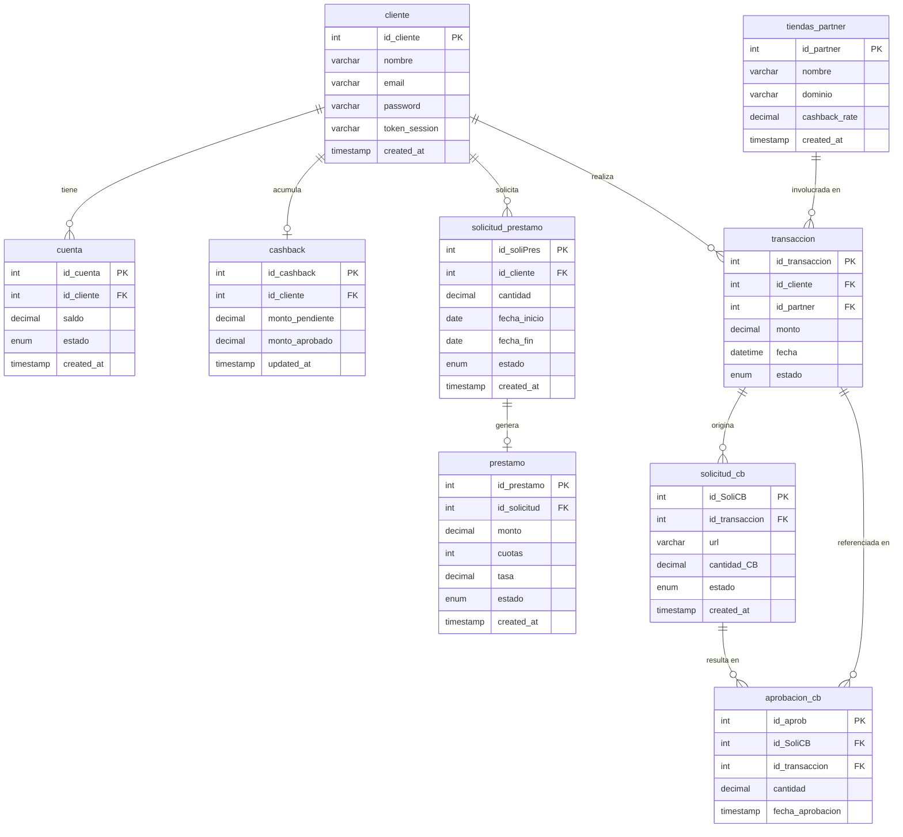

# Database Reference

SQL queries used by each endpoint, and the entity-relationship diagram for `kueski_db`.

---

## Entity-Relationship Diagram (Crow's Foot)



---

## Queries by Functional Requirement

### FR-1 · Autenticación — `POST /auth/login`

Valida las credenciales del cliente y retorna el JWT de sesión.

```sql
-- Busca al cliente por email para verificar credenciales
SELECT id_cliente, nombre, email, password
FROM cliente
WHERE email = ?;
```

**Tablas:** `cliente`
**Resultado esperado:** 1 fila. Si no existe o el password no coincide → 401.

---

### FR-2 · Dashboard del usuario — `GET /users/me/dashboard`

Retorna el saldo disponible de la cuenta activa y el cashback aprobado del cliente autenticado.

```sql
-- Saldo de la cuenta activa del cliente
SELECT saldo
FROM cuenta
WHERE id_cliente = ? AND estado = 'ACTIVA';
```

```sql
-- Cashback aprobado disponible del cliente
SELECT monto_aprobado
FROM cashback
WHERE id_cliente = ?;
```

Ambas queries se ejecutan en paralelo (`Promise.all`).

**Tablas:** `cuenta`, `cashback`
**Resultado esperado:** Al menos 1 fila en `cuenta`; la fila en `cashback` es opcional (default 0 si no existe).

---

### FR-3 · Préstamos activos — `GET /users/loans`

Lista todos los préstamos activos del cliente con su monto, tasa, cuotas y fecha de vencimiento.

```sql
SELECT
    p.id_prestamo,
    sp.cantidad,
    p.tasa,
    p.cuotas,
    p.created_at  AS fecha_aprobacion,
    sp.fecha_fin
FROM prestamo p
JOIN solicitud_prestamo sp ON p.id_solicitud = sp.id_soliPres
WHERE sp.id_cliente = ?
  AND p.estado = 'ACTIVO'
ORDER BY sp.fecha_fin ASC;
```

**Tablas:** `prestamo`, `solicitud_prestamo`
**Join:** `prestamo.id_solicitud = solicitud_prestamo.id_soliPres`
**Ordenamiento:** por fecha de vencimiento más próxima primero.
**Resultado esperado:** 0 o más filas; 0 filas → 404.

---

### FR-4 · Verificar beneficios de tienda — `GET /commerce/benefits?domain=`

Comprueba si un dominio pertenece a una tienda partner y retorna su porcentaje de cashback.

```sql
-- Verifica si el dominio es de un partner y obtiene su tasa de cashback
SELECT cashback_rate
FROM tiendas_partner
WHERE dominio = ?;
```

**Tablas:** `tiendas_partner`
**Resultado esperado:** 1 fila → `is_partner: true`; 0 filas → `is_partner: false`.

---

### FR-5 · Simular transacción — `POST /commerce/transactions/simulate`

Calcula planes de pago en cuotas para un monto dado, considerando saldo y cashback disponibles del cliente, y el cashback que se ganaría en el partner.

```sql
-- Saldo de la cuenta activa del cliente
SELECT saldo
FROM cuenta
WHERE id_cliente = ? AND estado = 'ACTIVA';
```

```sql
-- Cashback aprobado disponible del cliente
SELECT monto_aprobado
FROM cashback
WHERE id_cliente = ?;
```

```sql
-- Tasa de cashback del partner por id
SELECT cashback_rate
FROM tiendas_partner
WHERE id_partner = ?;
```

Las tres queries se ejecutan en paralelo (`Promise.all`).

**Tablas:** `cuenta`, `cashback`, `tiendas_partner`
**Lógica de negocio aplicada sobre los resultados:**

- `is_approved`: `monto <= saldo + cashback_aprobado`
- `cashback_to_earn`: `monto × (cashback_rate / 100)`
- Planes de pago: cuotas a 3, 6 y 12 meses con tasa anual del 8% (mensual compuesto).
