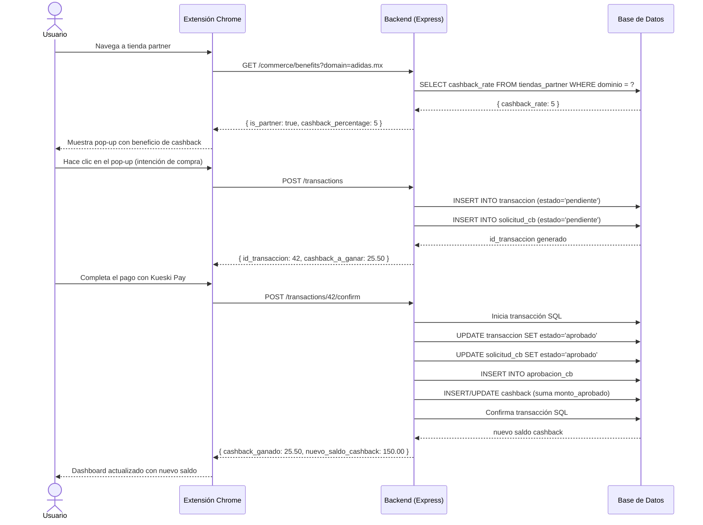
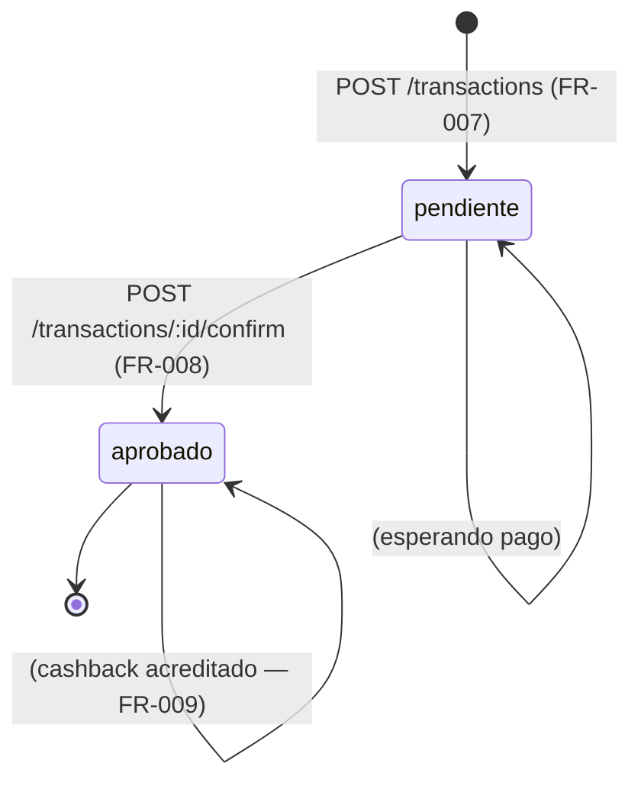
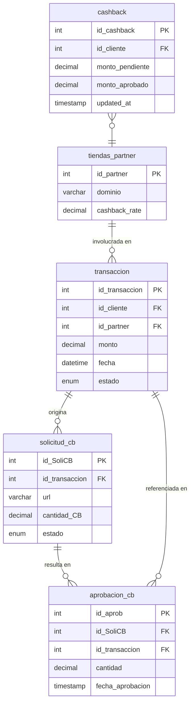

# Especificación: FR-007, FR-008 y FR-009

## Contexto

Estos tres FRs forman el flujo central de cashback de la extensión:

| FR | Nombre | Descripción |
|----|--------|-------------|
| FR-007 | Interacción pop-up | Registrar la intención de compra cuando el usuario hace clic en el pop-up |
| FR-008 | Evento de pago | Detectar un pago exitoso realizado con Kueski Pay |
| FR-009 | Actualizar cashback | Acreditar el cashback acumulado tras validar la compra |

---

## Bug previo a resolver

En `routes/auth.routes.js` hay dos errores que hacen que `GET /auth/verify` no funcione:

```js
// LÍNEA 3 — importa `verify` de la librería, no del controller:
import { verify } from "jsonwebtoken";   // ← INCORRECTO

// CORRECCIÓN:
import { login, verify } from "../controllers/auth.controller.js";

// LÍNEA 8 — usa authMiddleware sin importarlo. Agregar:
import { authMiddleware } from "../middleware/auth.middleware.js";
```

---

## Flujo completo



---

## Diagrama de estados de una transacción



---

## Endpoint 1 — `POST /transactions` (FR-007)

### Propósito
Registrar que el usuario tiene intención de compra al interactuar con el pop-up. Crea la
transacción en estado `pendiente` y genera la solicitud de cashback asociada.

### Autenticación
JWT requerido (`Authorization: Bearer <token>`).

### Request

```
POST /transactions
Content-Type: application/json
Authorization: Bearer <token>
```

```json
{
  "monto": 500.00,
  "id_partner": 1,
  "url": "adidas.mx/cart"
}
```

| Campo | Tipo | Requerido | Descripción |
|-------|------|-----------|-------------|
| `monto` | decimal | Sí | Monto de la compra a realizar |
| `id_partner` | int | Sí | ID de la tienda partner |
| `url` | string | Sí | URL de la página actual del usuario |

### Respuestas

**201 Created — éxito**
```json
{
  "status": "success",
  "data": {
    "id_transaccion": 42,
    "cashback_a_ganar": 25.50
  }
}
```

**400 Bad Request**
```json
{ "status": "error", "message": "Los campos monto, id_partner y url son requeridos." }
```

**401 Unauthorized**
```json
{ "status": "error", "message": "Token inválido o expirado." }
```

**404 Not Found** (partner no existe)
```json
{ "status": "error", "message": "La tienda partner no fue encontrada." }
```

### Queries SQL

```sql
-- 1. Obtener cashback_rate del partner
SELECT cashback_rate
FROM tiendas_partner
WHERE id_partner = ?;

-- 2. Insertar la transacción
INSERT INTO transaccion (id_cliente, id_partner, monto, fecha, estado)
VALUES (?, ?, ?, NOW(), 'pendiente');

-- 3. Insertar la solicitud de cashback
INSERT INTO solicitud_cb (id_transaccion, url, cantidad_CB, estado, created_at)
VALUES (?, ?, ?, 'pendiente', NOW());
```

**Cálculo de `cantidad_CB`:**
```
cantidad_CB = monto × (cashback_rate / 100)
```

### Lógica paso a paso

```
1. Extraer id_cliente del JWT (req.user.id_cliente)
2. Validar presencia de monto, id_partner, url en body
3. SELECT cashback_rate FROM tiendas_partner WHERE id_partner = ?
   → Si 0 filas: 404
4. cantidad_CB = parseFloat((monto * cashback_rate / 100).toFixed(2))
5. INSERT INTO transaccion → obtener insertId como id_transaccion
6. INSERT INTO solicitud_cb con id_transaccion del paso anterior
7. Responder 201 con id_transaccion y cashback_a_ganar
```

---

## Endpoint 2 — `POST /transactions/:id/confirm` (FR-008 + FR-009)

### Propósito
Confirmar que el pago fue exitoso (FR-008) y acreditar el cashback correspondiente en el
saldo del usuario (FR-009). Toda la operación es atómica (transacción SQL).

### Autenticación
JWT requerido (`Authorization: Bearer <token>`).

### Request

```
POST /transactions/42/confirm
Authorization: Bearer <token>
```

Sin body — el `id` viene en el path parameter.

### Respuestas

**200 OK — éxito**
```json
{
  "status": "success",
  "data": {
    "cashback_ganado": 25.50,
    "nuevo_saldo_cashback": 150.00
  }
}
```

**401 Unauthorized**
```json
{ "status": "error", "message": "Token inválido o expirado." }
```

**404 Not Found**
```json
{ "status": "error", "message": "Transacción no encontrada." }
```

**409 Conflict** (ya fue confirmada antes)
```json
{ "status": "error", "message": "La transacción ya fue procesada." }
```

### Queries SQL

```sql
-- 1. Verificar que la transacción existe y pertenece al usuario
SELECT id_transaccion, id_partner, monto, estado
FROM transaccion
WHERE id_transaccion = ? AND id_cliente = ?;

-- 2. Obtener la solicitud de cashback vinculada
SELECT id_SoliCB, cantidad_CB
FROM solicitud_cb
WHERE id_transaccion = ?;

-- 3. Actualizar transacción a 'aprobado'
UPDATE transaccion
SET estado = 'aprobado'
WHERE id_transaccion = ?;

-- 4. Actualizar solicitud_cb a 'aprobado'
UPDATE solicitud_cb
SET estado = 'aprobado'
WHERE id_SoliCB = ?;

-- 5. Registrar la aprobación
INSERT INTO aprobacion_cb (id_SoliCB, id_transaccion, cantidad, fecha_aprobacion)
VALUES (?, ?, ?, NOW());

-- 6. Acreditar cashback al usuario (FR-009)
--    Si el usuario ya tiene fila en cashback → sumar al saldo
--    Si no tiene fila → crearla
INSERT INTO cashback (id_cliente, monto_pendiente, monto_aprobado, updated_at)
VALUES (?, 0, ?, NOW())
ON DUPLICATE KEY UPDATE
    monto_aprobado = monto_aprobado + VALUES(monto_aprobado),
    updated_at = NOW();

-- 7. Leer el nuevo saldo para devolverlo en la respuesta
SELECT monto_aprobado
FROM cashback
WHERE id_cliente = ?;
```

### Lógica paso a paso

```
1. Extraer id_cliente del JWT
2. SELECT transaccion WHERE id_transaccion = ? AND id_cliente = ?
   → Si 0 filas: 404
   → Si estado ≠ 'pendiente': 409
3. SELECT solicitud_cb WHERE id_transaccion = ?
4. Iniciar transacción SQL (db.beginTransaction())
5.   UPDATE transaccion SET estado = 'aprobado'
6.   UPDATE solicitud_cb SET estado = 'aprobado'
7.   INSERT INTO aprobacion_cb
8.   INSERT INTO cashback ... ON DUPLICATE KEY UPDATE
9. COMMIT (db.commit())
10. SELECT monto_aprobado FROM cashback WHERE id_cliente = ?
11. Responder 200 con cashback_ganado y nuevo_saldo_cashback
    → Si falla cualquier paso: ROLLBACK y 500
```

> **Nota sobre transacciones SQL:** el pool de `mysql2` devuelve una `connection` individual
> para usar `beginTransaction` / `commit` / `rollback`. No usar `db.execute()` directamente
> para los pasos 5–8; obtener primero una conexión con `db.getConnection()`.

---

## Archivos a crear / modificar

```
Express/
├── controllers/
│   ├── auth.controller.js        (sin cambios)
│   ├── commerce.controller.js    (sin cambios)
│   ├── user.controller.js        (sin cambios)
│   └── transaction.controller.js ← CREAR (trackIntent + confirmPayment)
├── routes/
│   ├── auth.routes.js            ← CORREGIR bug de imports
│   ├── commerce.routes.js        (sin cambios)
│   ├── users.routes.js           (sin cambios)
│   └── transaction.routes.js     ← CREAR
└── app.js                        ← AGREGAR montaje de /transactions
```

### `transaction.routes.js` — estructura esperada

```js
import express from "express";
import { trackIntent, confirmPayment } from "../controllers/transaction.controller.js";

var router = express.Router();

router.post("/", trackIntent);
router.post("/:id/confirm", confirmPayment);

export default router;
```

### `app.js` — línea a agregar

```js
import transactionRoutes from "./routes/transaction.routes.js";

// Junto a los demás app.use:
app.use("/transactions", authMiddleware, transactionRoutes);
```

---

## Diagrama de tablas involucradas



---

## Verificación manual (orden de prueba)

```bash
# 1. Login
curl -X POST http://localhost:3000/auth/login \
  -H "Content-Type: application/json" \
  -d '{"email":"usuario@test.com","password":"1234"}'
# Guardar el token devuelto

# 2. Verificar que /auth/verify ya funciona (post bug-fix)
curl http://localhost:3000/auth/verify \
  -H "Authorization: Bearer <token>"
# Esperado: { "status": "success", "is_valid": true }

# 3. Registrar intención de compra (FR-007)
curl -X POST http://localhost:3000/transactions \
  -H "Authorization: Bearer <token>" \
  -H "Content-Type: application/json" \
  -d '{"monto": 500, "id_partner": 1, "url": "adidas.mx/cart"}'
# Esperado: { "data": { "id_transaccion": 42, "cashback_a_ganar": 25.00 } }

# 4. Confirmar pago (FR-008 + FR-009)
curl -X POST http://localhost:3000/transactions/42/confirm \
  -H "Authorization: Bearer <token>"
# Esperado: { "data": { "cashback_ganado": 25.00, "nuevo_saldo_cashback": 25.00 } }

# 5. Confirmar que el dashboard refleja el nuevo saldo (FR-009)
curl http://localhost:3000/users/me/dashboard \
  -H "Authorization: Bearer <token>"
# Esperado: cashback.available = 25.00

# 6. Intentar confirmar la misma transacción de nuevo
curl -X POST http://localhost:3000/transactions/42/confirm \
  -H "Authorization: Bearer <token>"
# Esperado: 409 { "message": "La transacción ya fue procesada." }
```
