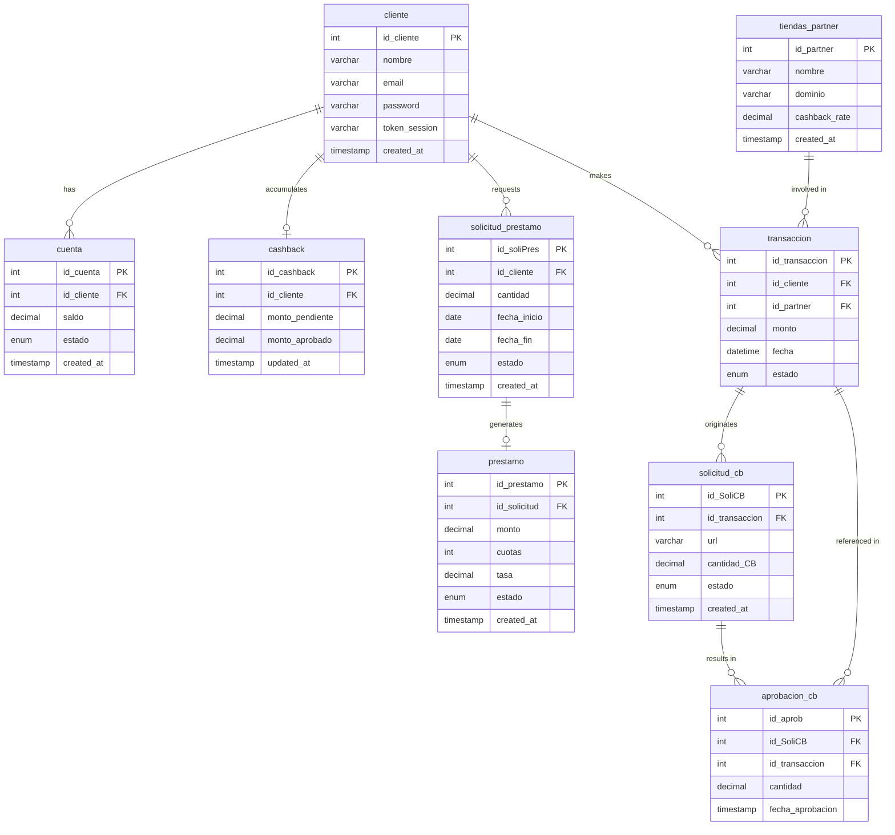

# Database Reference

Schema, entity-relationship diagram, and SQL queries for `kueski_db` (MySQL 8).

---

## Entity-Relationship Diagram



---

## Table Descriptions

| Table | Purpose |
| --- | --- |
| `cliente` | Registered users. Holds credentials and personal data. |
| `cuenta` | Each client has one active account with a MXN balance. |
| `cashback` | Tracks pending and approved cashback per client. One row per client (`UNIQUE id_cliente`). |
| `solicitud_prestamo` | Loan applications (pending / approved / rejected). |
| `prestamo` | Approved loans linked to a `solicitud_prestamo`. Tracks installments, rate, and status. |
| `tiendas_partner` | Partner stores recognized by the extension. Stores domain and cashback rate. |
| `transaccion` | Records every purchase made through KueskiPay. Status: `pendiente → aprobado`. |
| `solicitud_cb` | Cashback request linked to a transaction. Created when a purchase intent is registered. |
| `aprobacion_cb` | Audit record created when a cashback request is approved and credited. |

---

## Queries by Endpoint

### `POST /auth/login`

```sql
SELECT id_cliente, nombre, email, password
FROM cliente
WHERE email = ?;
```

**Tables:** `cliente` · **Result:** 1 row expected. No match or wrong password → 401.

---

### `GET /users/me/dashboard`

Both queries run in parallel via `Promise.all`.

```sql
-- Available balance from the client's active account
SELECT saldo
FROM cuenta
WHERE id_cliente = ? AND estado = 'ACTIVA';
```

```sql
-- Approved cashback available to spend
SELECT monto_aprobado
FROM cashback
WHERE id_cliente = ?;
```

**Tables:** `cuenta`, `cashback` · **Note:** The `cashback` row may not exist — defaults to 0.

---

### `GET /users/loans`

```sql
SELECT
    p.id_prestamo,
    sp.cantidad,
    p.tasa,
    p.cuotas,
    p.created_at  AS fecha_aprobacion,
    sp.fecha_fin
FROM prestamo p
JOIN solicitud_prestamo sp ON p.id_solicitud = sp.id_soliPres
WHERE sp.id_cliente = ?
  AND p.estado = 'ACTIVO'
ORDER BY sp.fecha_fin ASC;
```

**Tables:** `prestamo`, `solicitud_prestamo` · **Result:** Ordered by nearest due date. 0 rows → 404.

---

### `GET /commerce/benefits`

```sql
SELECT id_partner, cashback_rate
FROM tiendas_partner
WHERE dominio = ?;
```

**Tables:** `tiendas_partner` · **Result:** 1 row → `is_partner: true`. 0 rows → `is_partner: false`.

---

### `POST /transactions/simulate`

All three queries run in parallel via `Promise.all`. No rows are written — this is a read-only calculation.

```sql
SELECT saldo FROM cuenta WHERE id_cliente = ? AND estado = 'ACTIVA';
```

```sql
SELECT monto_aprobado FROM cashback WHERE id_cliente = ?;
```

```sql
SELECT cashback_rate FROM tiendas_partner WHERE id_partner = ?;
```

**Business logic applied over the results:**

- `is_approved`: `monto <= saldo + monto_aprobado`
- `cashback_to_earn`: `monto × (cashback_rate / 100)`
- Payment plans: 3, 6, and 12 installments at 8% annual interest, compounded monthly

---

### `POST /transactions` (register purchase intent)

```sql
SELECT cashback_rate FROM tiendas_partner WHERE id_partner = ?;
```

```sql
INSERT INTO transaccion (id_cliente, id_partner, monto, fecha, estado)
VALUES (?, ?, ?, NOW(), 'pendiente');
```

```sql
INSERT INTO solicitud_cb (id_transaccion, url, cantidad_CB, estado, created_at)
VALUES (?, ?, ?, 'pendiente', NOW());
```

`cantidad_CB = monto × (cashback_rate / 100)`

---

### `POST /transactions/:id/confirm` (atomic — SQL transaction)

Steps 3–6 run inside a `beginTransaction` / `commit` block. If any step fails, all changes are rolled back.

```sql
-- 1. Verify transaction exists and belongs to this user
SELECT estado FROM transaccion WHERE id_transaccion = ? AND id_cliente = ?;
```

```sql
-- 2. Get the linked cashback request
SELECT id_SoliCB, cantidad_CB FROM solicitud_cb WHERE id_transaccion = ?;
```

```sql
-- 3. Approve the transaction
UPDATE transaccion SET estado = 'aprobado' WHERE id_transaccion = ?;
```

```sql
-- 4. Approve the cashback request
UPDATE solicitud_cb SET estado = 'aprobado' WHERE id_SoliCB = ?;
```

```sql
-- 5. Create the approval audit record
INSERT INTO aprobacion_cb (id_SoliCB, id_transaccion, cantidad, fecha_aprobacion)
VALUES (?, ?, ?, NOW());
```

```sql
-- 6. Credit cashback to the user (insert on first purchase, add on subsequent ones)
INSERT INTO cashback (id_cliente, monto_pendiente, monto_aprobado, updated_at)
VALUES (?, 0, ?, NOW())
ON DUPLICATE KEY UPDATE
  monto_aprobado = monto_aprobado + VALUES(monto_aprobado),
  updated_at = NOW();
```

```sql
-- 7. Read the new balance to return in the response
SELECT monto_aprobado FROM cashback WHERE id_cliente = ?;
```
